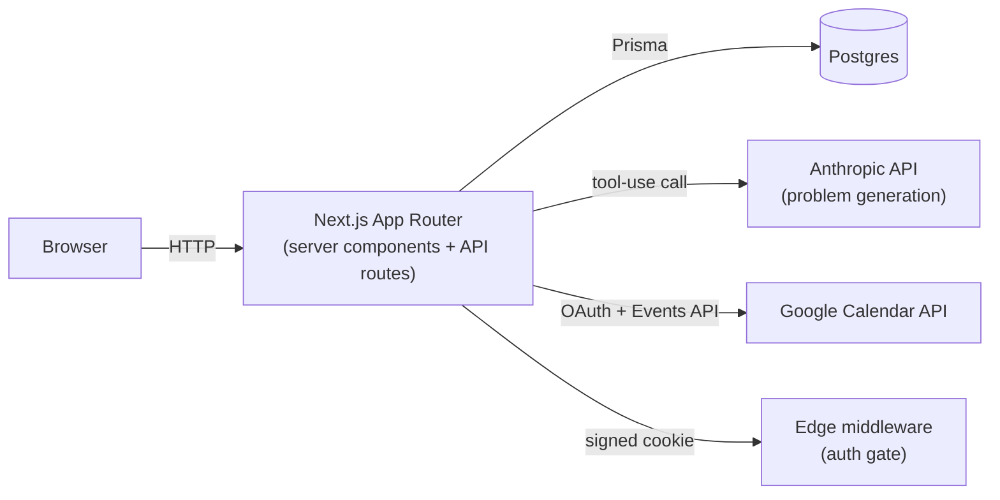

# Session Desk

[](https://github.com/andrew-wen2/tutor-app/actions/workflows/ci.yml)

A tutoring session manager: a calendar mirrored to Google Calendar, a student roster that tracks payments and learning history, and an LLM pipeline that generates practice problems calibrated to each student's level. Built to run a real one-tutor business (~6 active students), then opened up to multiple users.

<!--
Screenshots go here once captured:


-->

## What it does

- **Calendar** — month/week views modeled on Google Calendar, drag to reschedule, drag an edge to resize, weekly/biweekly recurrence, one-way mirror to Google Calendar.
- **Students** — roster with rate, profile (subject/level/goals as free text), derived "learned so far" timeline, what's owed, archiving.
- **Payments** — owed totals over a filterable date range, mark-paid, CSV export.
- **Problem generation** — server-side call to Claude, calibrated per student from their profile and recent session topics, rendered with KaTeX. For contest math it anchors generated problems to a corpus of real AMC/AIME/F=ma problems at matching difficulty; for any other subject it falls back to a model-classified difficulty rubric. Every generated problem is verified (format, answer validity, no truncation) before being returned, with one bounded regeneration pass for anything that fails.
- **Dashboard** — revenue, hours, and trend charts computed server-side from the same billing rules the student page uses.

## Tech stack

Next.js 15 (App Router) · TypeScript · React 19 · PostgreSQL via Prisma · `@anthropic-ai/sdk` for generation · `googleapis` for Calendar sync and Google sign-in · KaTeX for math rendering · Tailwind (hand-rolled design tokens, no UI/icon library) · Vitest for the pure-logic test suite · Vercel for deploy.

## Architecture



The database is the source of truth for everything; Google Calendar is a one-way mirror kept in sync from it, and its failures never block a save. Generation is a single plan-driven pipeline — no per-subject engines, no subject field in the UI.

## Running locally

```bash
npm install
cp .env.example .env.local   # fill in DATABASE_URL at minimum; see comments for the rest
npx prisma migrate deploy
npm run dev
```

Other useful commands:

```bash
npm run build     # prisma generate + next build — the CI gate
npm run lint
npm run check      # Vitest over the pure lib/ helpers: recurrence + DST, the owed rule, CSV escaping
npm run set-password -- <email> <password>
```

`ANTHROPIC_API_KEY` and the `GOOGLE_CLIENT_ID`/`GOOGLE_CLIENT_SECRET` pair are optional locally — without them, problem generation and Google sign-in/Calendar sync are simply unavailable, and the rest of the app runs fine.

## Engineering decisions

A few of the choices that shaped this codebase, and why they were made this way rather than the more obvious alternative.

**Data model**
- **`Session.status` is a `String` with a `normalizeStatus`/`isSessionStatus` helper pair, not a Prisma enum.** An enum throws on read the moment any row holds an unexpected value — one bad row would 500 the entire calendar. A string that normalizes on read and validates on write degrades gracefully instead, while a database `CHECK` constraint (which Prisma doesn't manage) still enforces integrity at the storage layer. Read-path resilience and write-path validation are different problems; this treats them as such instead of picking one mechanism for both.
- **"Owed," "billable," and "effective status" are derived at query time, never stored.** A past `scheduled` session reads as *Completed* through a pure function rather than a write-back, so nothing has to re-mark every session as it passes.
- **No `Payment` table — `paid` is a boolean on `Session`.** Adding a payments table before partial payments exist would be schema complexity with no user behind it.
- **The Payments tab was built, then deleted.** It reported money in two places with two different scopes that visibly disagreed — an all-time dashboard total next to a filtered ledger total, disagreeing badly enough that the UI needed a literal "(filtered)" label to explain why. Rather than reconcile the two forever, the redundant surface was removed and money now lives in exactly one place.

**Time & correctness**
- **Recurrence expansion runs in the browser, not on the server.** Vercel runs UTC; expanding a weekly series server-side would silently shift a 5pm session across a DST boundary for anyone not in UTC. The server only validates the bounds of what the client posts (order, span, a 52-occurrence cap) — it never re-derives the dates itself.
- **Dashboard charts use a server-computed seed, re-verified client-side after mount, instead of computing bucket boundaries in the client.** Chart bucket boundaries are timezone-sensitive; a client component computing `new Date()`-based buckets on first render would produce a different answer than the server-rendered HTML and trip a hydration mismatch. The server computes the real numbers once and ships them as a seed; the client re-runs the identical pure function afterward, not a different one.
- **"Billable revenue" means started and not cancelled — never "paid."** This isn't a style preference: there's no `paidAt` timestamp column, so "cash collected over time" literally cannot be reconstructed from the schema. The UX definition was set to match what the data can actually support, rather than faked with an approximation.
- **Schema migrations that drop a column always ship separately from, and after, the code deploy that stops referencing it.** Prisma emits an explicit column list on every query; dropping a column while an old server instance is still serving throws on every page load. Column drops and additions are not symmetric operations, and the migration strategy treats them accordingly.

**Auth & security**
- **Auth is hand-rolled (bcrypt + a stateless HMAC-signed cookie) instead of a library like NextAuth**, because the session has to verify inside `middleware.ts`, which runs on the Edge runtime — Web Crypto works there; most full-featured auth libraries assume a Node runtime.
- **Every route scopes its Prisma queries to the current user, with an explicit ownership check before any by-id mutation.** Stated as a hard constraint rather than left as convention, since it's the one category of bug (IDOR) that's invisible until someone deliberately probes for it.
- **New authenticated endpoints are placed outside `/api/auth/*` on purpose**, because that whole prefix is unauthenticated-by-construction in the middleware's routing rule — a password-change endpoint living under it would silently bypass the auth gate.

**LLM generation pipeline**
- **One generation pipeline for every subject, with no subject field anywhere in the UI.** Each request derives a `GenerationPlan` from free-text profile and topic: a cheap deterministic path when a known competition can be matched, and a cheap Haiku classification call only when it can't. This avoids paying for LLM classification on the common case while still generalizing to any subject.
- **Structured output goes through Anthropic tool-use, never `JSON.parse` of free text** — LaTeX backslashes in generated math reliably break naive JSON parsing.
- **Every generated problem passes a verification layer before being returned** (format, real non-placeholder answers, no truncated or backtracking solutions), with failures regenerated once, seeded with the already-accepted problems as negative examples so the retry doesn't just reproduce a near-duplicate.
- **The hardest difficulty tier adapts a real corpus problem into an isomorphic variant through a multi-stage pipeline (sketch → transpose → optional audit → expand)** instead of generating from scratch in one call, because one-shot generation at that difficulty produced inconsistent, backtracking solutions in practice.

**Frontend**
- **Optimistic UI updates are an overrides map layered over the server rows, not a `useState` snapshot.** A `useState` initializer doesn't re-run when the same component instance re-renders with new server rows — e.g. after a filter change — which silently showed paid sessions as unpaid under a naive snapshot. One pattern, reused everywhere optimistic state is needed.
- **Drag-and-drop hit-testing uses `document.elementFromPoint` against data attributes, not cached column geometry**, so it keeps working through mid-drag scrolling and needs no separate geometry cache for the week grid versus the month grid.
- **No UI, icon, or animation library.** For a small, opinionated surface like this one, the abstraction cost of a general-purpose library (bundle size, fighting its defaults) outweighed the benefit — with accessibility handled explicitly instead of assumed: a single focus-ring definition, status never conveyed by color alone, full `prefers-reduced-motion` support.
