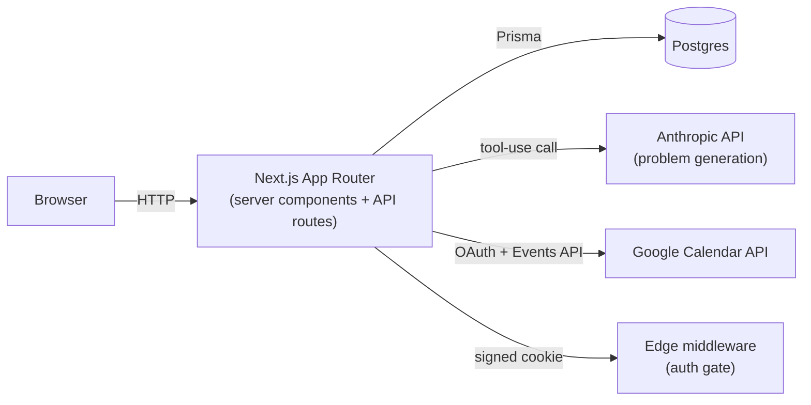

# SessionDesk

[](https://github.com/andrew-wen2/tutor-app/actions/workflows/ci.yml)
[](LICENSE)

A tutoring session manager — calendar, student roster, payments, and calibrated LLM-generated practice problems. Runs a real tutoring business: 15+ students, $75–120/hr, $5,000+ in tracked revenue.

## Features

- **Calendar** — month/week views, drag to reschedule/resize, weekly/biweekly recurrence, one-way Google Calendar mirror.
- **Students** — roster with rate, free-text profile, a derived learning-history timeline, amount owed, archiving.
- **Payments** — owed totals over a filterable date range, mark-paid (optimistic, via an overrides map over server rows so a filter re-render can't silently revert it), CSV export.
- **Problem generation** — one subject-agnostic pipeline: a `GenerationPlan` derived per request, not a per-subject engine. Anchored to a real AMC/AIME/F=ma corpus for contest math, a model-classified rubric otherwise. Structured output comes back through Anthropic tool-use rather than `JSON.parse` (LaTeX backslashes break naive JSON parsing). Every problem passes format/hygiene guards (no truncation, no thinking-out-loud, no placeholder answers), and its answer is independently re-derived by a second model (Claude Opus, never shown the generator's own answer) before the set is returned — agreement is what makes the stored answer trustworthy, not the generator's say-so.
- **Dashboard** — revenue, hours, and trend charts, computed server-side from the same billing rules as the student page.

## Tech stack

Next.js 15 (App Router) · TypeScript · React 19 · PostgreSQL/Prisma · `@anthropic-ai/sdk` · `googleapis` (Calendar sync + Google sign-in) · KaTeX · Tailwind (hand-rolled tokens, no UI library) · Vitest · Vercel.

## Architecture



`Session.status` is a validated `String`, not a Prisma enum — an enum throws on read for any unexpected value, which would 500 the whole calendar; a DB-level `CHECK` constraint enforces integrity instead.

## Getting started

```bash
npm install
cp .env.example .env.local   # fill in DATABASE_URL at minimum
npx prisma migrate deploy
npm run dev
```

| Command | Purpose |
|---|---|
| `npm run build` | `prisma generate` + `next build` — the CI gate |
| `npm run check` | Vitest over pure `lib/` logic: recurrence + DST, the owed rule, CSV escaping |
| `npm run lint` | ESLint |
| `npm run set-password -- <email> <password>` | Set/reset a user's password |
| `npm run eval:solver -- --yes` | Score the independent answer-solver against ~60 real corpus problems with known answers (see `scripts/README.md`) |
| `npm run eval:generation -- --yes` | Run the generation pipeline over fixture profiles, then `--rate` and `--compare` two runs |

## License

MIT © Andrew Wen — see [LICENSE](LICENSE).
